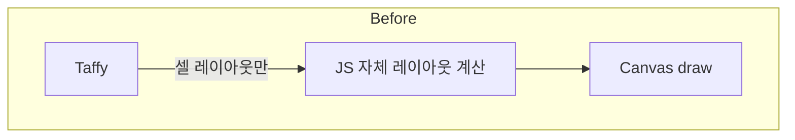
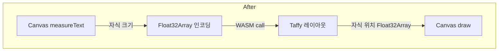
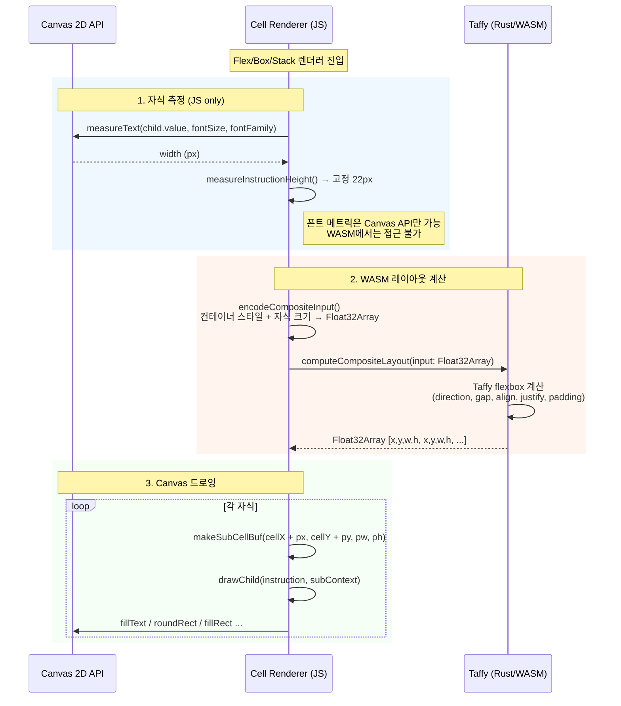
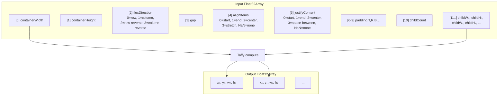
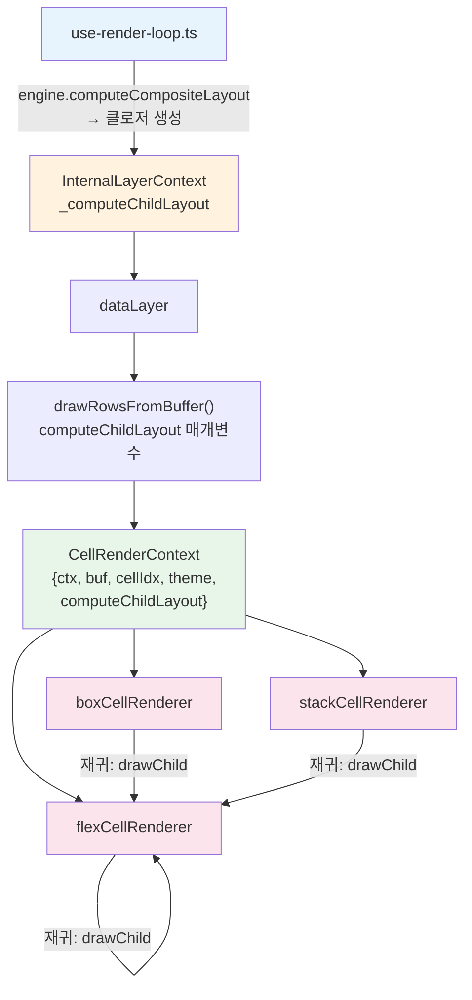
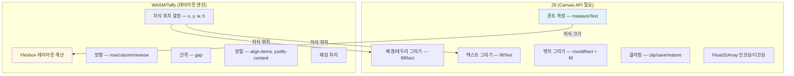
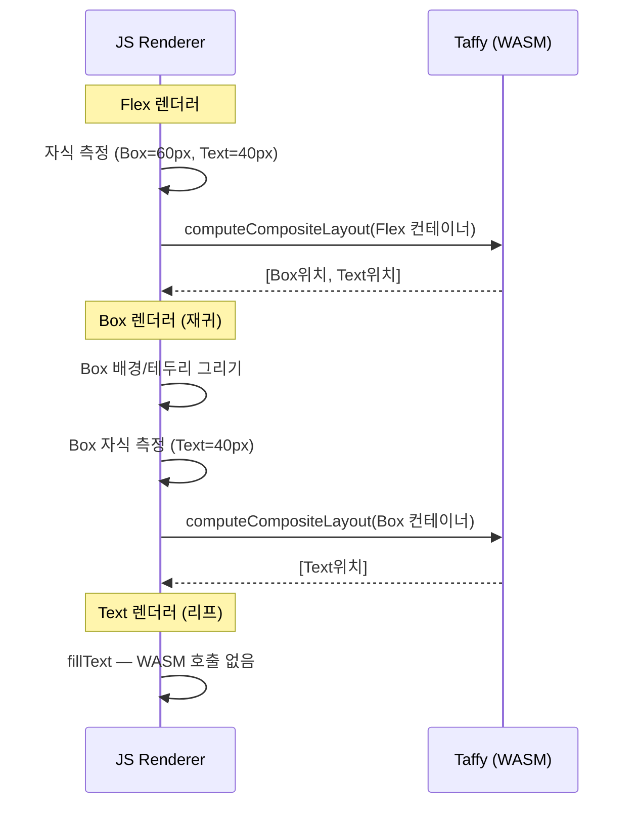

# Composite Layout Architecture

셀 내부 복합 컴포넌트(Flex/Box/Stack)의 레이아웃을 Rust/Taffy로 통합한 아키텍처.

---

## Before vs After

---

## 전체 흐름

---

## 데이터 인코딩

---

## 컨텍스트 전달 경로

---

## 컴포넌트별 Taffy 매핑

| 컴포넌트  | flexDirection  | gap         | alignItems  | justifyContent | padding                         |
| --------- | -------------- | ----------- | ----------- | -------------- | ------------------------------- |
| **Flex**  | 사용자 지정    | 사용자 지정 | 사용자 지정 | 사용자 지정    | 셀 padding 사용                 |
| **Stack** | direction prop | gap prop    | `"center"`  | `"start"`      | 없음                            |
| **Box**   | `"column"`     | 0           | `"stretch"` | `"start"`      | 없음 (별도 border/padding 처리) |

---

## JS가 담당하는 것 vs WASM이 담당하는 것

---

## 재귀 중첩 예시

`Flex > Box > Text` 같은 중첩 구조에서 각 레벨마다 독립적인 WASM 호출이 발생:

각 WASM 호출은 독립적이며, Taffy 트리를 생성→계산→클리어하므로 버퍼 충돌이 없습니다.
