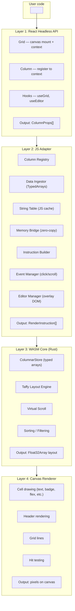
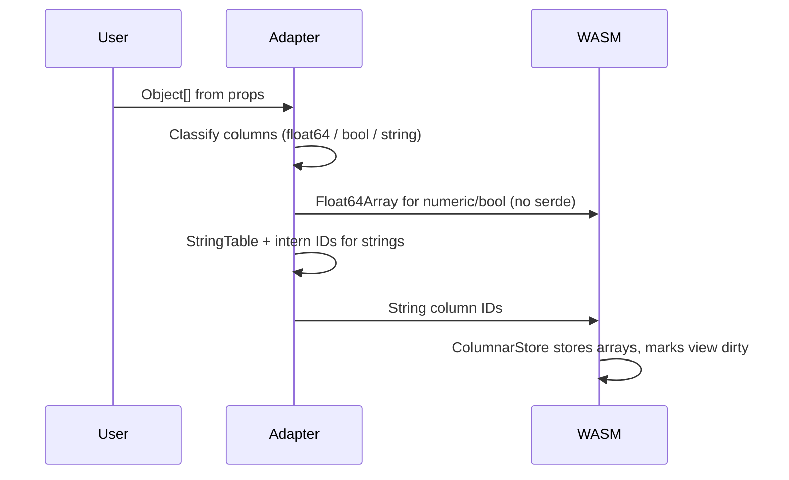
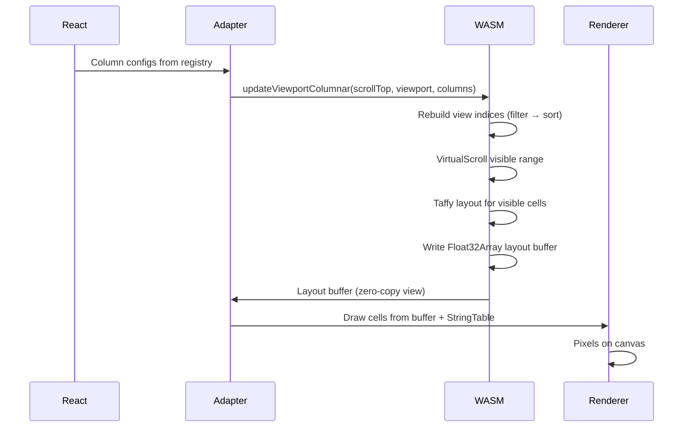
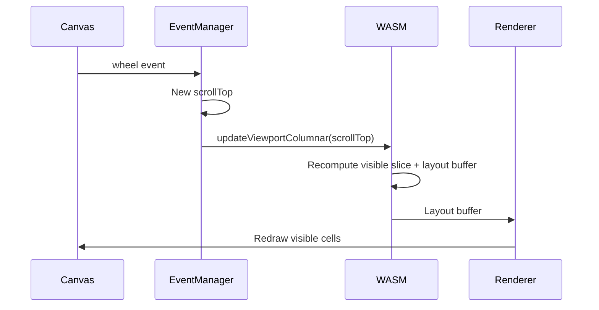

# Architecture

High-level flow: React components and hooks → JS adapter (column registry, data ingestion, memory bridge) → WASM core (columnar store, Taffy layout, virtual scroll) → canvas renderer.

## System overview

## Data flow

### Data ingestion (on data change)

1. `Object[]` arrives from user (e.g. API response).
2. JS DataIngestor classifies columns by type (float64 / bool / string).
3. Numeric/bool columns → `Float64Array` → WASM memory copy (no serde).
4. String columns → JS StringTable (display) + intern IDs → WASM (sort/filter).
5. ColumnarStore stores type-specific arrays and marks the view dirty.

### Render cycle (per frame)

1. React reconciles → column configs collected via ColumnRegistry.
2. Single WASM call: `engine.updateViewportColumnar(scrollTop, viewport, columns)`.
   - ColumnarStore rebuilds view indices (filter → sort on u32 indices).
   - VirtualScroll computes visible row range.
   - Taffy computes flexbox layout for visible cells.
   - Writes to flat Float32Array layout buffer (stride 8 per cell).
3. JS reads layout buffer via zero-copy MemoryBridge (Float32Array view).
4. Canvas renderer draws each cell using layout buffer + StringTable.

### Scroll cycle (hot path)

React is **not** involved in the scroll path so the engine can keep 60fps with large data.

### Edit cycle

Editors are DOM overlays (canvas cannot host native inputs). Only the active cell uses DOM; the rest stays on canvas.

```mermaid
sequenceDiagram
  participant User
  participant Renderer
  participant EditorManager

  User->>Renderer: Double-click cell
  Renderer->>Renderer: hitTest via layout buffer → CellCoord
  Renderer->>EditorManager: Column editor type + value
  EditorManager->>EditorManager: Overlay <input> at cell position
  User->>EditorManager: Edit and Enter/blur
  EditorManager->>EditorManager: Commit → update data, re-render
```

## Taffy integration

[Taffy](https://github.com/DioxusLabs/taffy) is a Rust flexbox/grid layout engine. We use it to compute cell positions.

| Manual layout             | Taffy                      |
| ------------------------- | -------------------------- |
| Breaks with column resize | Flexbox handles it         |
| No wrapping/alignment     | Full flex alignment        |
| Hard-coded spacing        | Gap, padding, margin       |
| Fragile position math     | Declarative style → layout |

Layout is computed only for **visible rows** (virtual scroll window), so Taffy runs on a small set of nodes each frame.

## Module boundaries

- **crates/core** — Pure Rust (no WASM): ColumnarStore, LayoutEngine, sort/filter, virtual slice. Testable with `cargo test`.
- **crates/wasm** — WASM bindings: TypedArray ingestion, `updateViewportColumnar`, layout buffer access. Thin layer over core.
- **packages/grid (JS)** — ColumnRegistry, DataIngestor, StringTable, MemoryBridge, EventManager, EditorManager, CanvasRenderer, React components and hooks.
