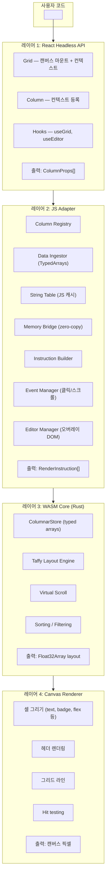
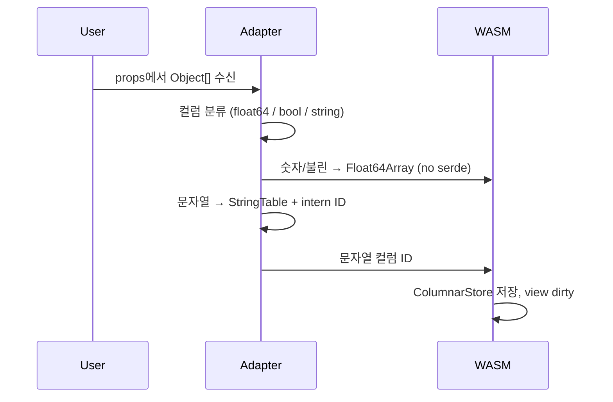
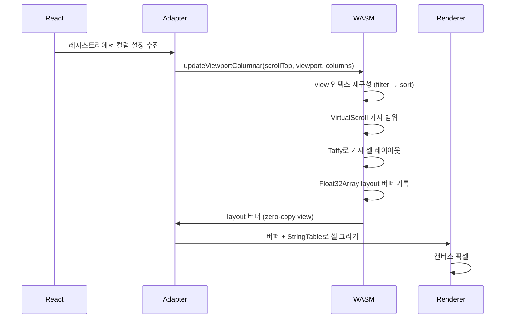
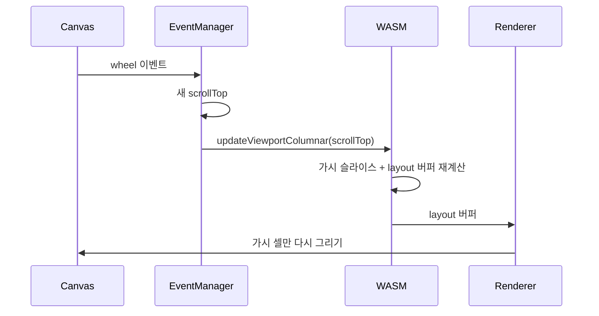

# 아키텍처

전체 흐름: React 컴포넌트/훅 → JS 어댑터(컬럼 레지스트리, 데이터 수집, 메모리 브리지) → WASM 코어(컬럼 스토어, Taffy 레이아웃, 가상 스크롤) → 캔버스 렌더러.

## 시스템 개요

## 데이터 흐름

### 데이터 수집 (data 변경 시)

1. 사용자로부터 `Object[]` 전달 (예: API 응답).
2. JS DataIngestor가 컬럼 타입 분류 (float64 / bool / string).
3. 숫자/불린 → `Float64Array` → WASM 메모리 복사 (no serde).
4. 문자열 → JS StringTable(표시) + intern ID → WASM(정렬/필터).
5. ColumnarStore에 타입별 배열 저장, view dirty 표시.

### 렌더 사이클 (프레임마다)

### 스크롤 사이클 (핫 경로)

스크롤 경로에는 React가 관여하지 않아 대량 데이터에서도 60fps 유지가 가능합니다.

### 편집 사이클

에디터는 DOM 오버레이입니다(캔버스는 네이티브 입력을 호스팅할 수 없음). 활성 셀만 DOM을 쓰고 나머지는 캔버스에 유지됩니다.

```mermaid
sequenceDiagram
  participant User
  participant Renderer
  participant EditorManager

  User->>Renderer: 셀 더블클릭
  Renderer->>Renderer: layout 버퍼로 hitTest → CellCoord
  Renderer->>EditorManager: 컬럼 editor 타입 + 값
  EditorManager->>EditorManager: 셀 위치에 <input> 오버레이
  User->>EditorManager: 수정 후 Enter/blur
  EditorManager->>EditorManager: commit → 데이터 반영, 재렌더
```

## Taffy 연동

[Taffy](https://github.com/DioxusLabs/taffy)는 Rust 기반 flexbox/grid 레이아웃 엔진입니다. 셀 위치 계산에 사용합니다.

| 수동 레이아웃         | Taffy                    |
| --------------------- | ------------------------ |
| 컬럼 리사이즈 시 깨짐 | Flexbox로 처리           |
| 줄바꿈/정렬 없음      | 전체 flex 정렬           |
| 하드코딩된 간격       | gap, padding, margin     |
| 불안정한 위치 계산    | 선언적 스타일 → 레이아웃 |

레이아웃은 **가시 행**만 대상으로 계산되므로(가상 스크롤), 매 프레임 적은 노드만 Taffy에 넘어갑니다.

## 모듈 경계

- **crates/core** — 순수 Rust(no WASM): ColumnarStore, LayoutEngine, sort/filter, virtual slice. `cargo test`로 테스트.
- **crates/wasm** — WASM 바인딩: TypedArray 수집, `updateViewportColumnar`, layout 버퍼 접근. core 위의 얇은 레이어.
- **packages/grid (JS)** — ColumnRegistry, DataIngestor, StringTable, MemoryBridge, EventManager, EditorManager, CanvasRenderer, React 컴포넌트/훅.
